# Introduction

This report details the steps taken by Arne Lescrauwaet (852617312), Joachim Verschelde (852594432) and Alexander Van Hecke (852631385) for the second assignment of the 2023 Deep Neural Engineering course organised by the Open University [@dne].

For this assignment we look at different attention mechanisms in transformers [@transformer] for use with time series data.  The attention mechanism enables a transformer model to selectively focus on relevant parts of the input data.  The goal is to be able to capture long range dependencies and relationships between items of the input data.  This is particularly important for time series data containing recurring patterns, e.g. hourly traffic counts on busy highways and hourly power consumption of nations.  We expect these types of data to contain clear and recurring patterns (i.e. traffic will typically be lower during weekends) and we want an attention mechanism to capture these patterns.  In addition to capturing recurring patterns, we would also like to be able to capture the ``local context'' of a pattern to predict new values.  That is, when encountering an event that is similar to a past event, we want to take the outcome of that past event into account in our prediction.

Different kinds of attention mechanisms exist.  Convolutional self-attention is introduced in [@paper], which aims to capture the local context of input events, but does this using a symmetric convolution, thereby taking both input data leading to a particular event and the outcome of that event into account.  A dual-stage attention mechanism is used for a Recurrent Neural Network (RNN) architecture in [@dualstage], using an input attention mechanism in an encoder step, and a temporal attention mechanism in a decoder step.

Even though transformers were originally designed in the field of natural language processing (NLP), a lot of work has been done to use transformers with time series data.  An overview of different ways to adapt transformers to time series data is given in [@timeseries1].  The time2vec encoding mechanism is introduced in [@timeseries2].  The authors of this paper use transformer models to predict stock prices, and claim these models can be used both for short and long term predictions.  The effectiveness of applying transformers to time series data is tested in [@timeseries3].

The original transformer architecture introduces a quadratic time and space complexity.  Much work has been done to improve on this.  The LogSparse transformer is introduced in [@paper], which reduces the memory cost to $O(L {(\log {}L)}^2)$.  The informer model [@informer] even achieves $O(L {\log {}L)}$ memory complexity.  In this report we will focus on attention mechanisms in the context of time series forecasting, ignoring space and time complexity of the transformer algorithm.

# Goal

In this paper, we focus on using transformers for time series forecasting. We aim to compare different attention mechanism and determine which mechanism best captures the outcome of past events.  We formulate a first research question : 

> **RQ 1 : When comparing regular self-attention, convoluted self-attention, right-padded convoluted self-attention and fourier transform based self-attention, which mechanism best predicts future values using root mean square error (RMSE) as metric?**

The Elia dataset used is fully described in [the dataset description section](#sec:dataset).  It not only contains time series data, but also day+1 and day+7 predictions of the same data.  We formulate a second research question : 

> **RQ 2 : Is the RMSE of a transformer model better than the Elia prediction model?**

Firstly, this report will look at the characteristics of the dataset used and discuss pre-processing steps.  Then, we will consider several attention mechanisms,  discuss design and implementation details and finally evaluate the performance of these attention mechanisms on the dataset.

# Data analysis

## Dataset description {#sec:dataset}

We use data from Elia [@elia], which operates the electricity transmission network in Belgium.  In particular, we use the solar power forecast datasets.  These contain time series of actual measured power in megawatt (MW), and also  day+1 and day+7 predictions of solar power output in MW.  Data is available in monthly datasets for the period of February 2013 to February 2024.  Measurements and predictions are recorded every quarter of an hour.  The measured value is always the amount of power equivalent to the running average measured for that particular quarter-hour.  The layout of the dataset is fully described here [@dataset].  We recap the most important points in Table \ref{table:features}.

| feature          | description                           | range                            |
|:-----------------|:--------------------------------------|:---------------------------------|
| DateTime         | Date and time per quarter hour        | [00:00 - 24:00] in quarter hours |
| Measurement      | Measured solar power production in MW | [0.0 - 6000.0]                   |
| Day+1 prediction | D+1 solar power forecast in MW        | [0.0 - 6000.0]                   |
| Day+7 prediction | D+7 solar power forecast in MW        | [0.0 - 6000.0]                   |

Table:  Features captured per quarter-hour in @dataset \label{table:features}

## Data general properties

Data is not normally distributed but highly regular and contains obvious day - night recurring patterns.  Since we are using solar power production data, data typically shows no values in the early morning, building towards a peak around noon, and then slowly reducing values towards the evening.  This is illustrated in Figure @{fig:recurrent-pattern-september}.

There are obvious differences in solar power generation between summer months and winter months, but the general pattern remains the same, as illustrated in Figure @{fig:recurrent-pattern-january}.

## Data pre-processing

The Elia data [@dataset] is very fine grained and contains $24*4=96$ measurements per day, resulting in $30*24*4=2880$ measurements for a 30 day month.  In order to be able to limit memory and computational resources, we have added the possibility to aggregate this dataset.  Possible choices are **(i)** no aggregation, **(ii)** hourly aggregation, **(iii)** aggregation every 4 hours (starting from 00:00, resulting in 6 values per day), and finally **(iv)** aggregation per day.  Aggregation is done by averaging the values in the selected timeframe.

Elia provides a lot of historical data, going from February of 2013 to February of 2024.  All data were taken into account, in order to maximize the possibility of finding interesting patterns in the data.  Input length $L$ has to be chosen carefully in basic transformer architectures because of the quadratic complexity in $L$.  Taking too few measurements into acount, it will be difficult to spot similar events in the past.  Taking too many measurements into account, it will be prohibitely expensive in terms of memory and computational resources to train and evaluate the model.  The model implemented allowed for easy selection of input length $L$.  This is related to the level of aggregations in terms of how many hours or days this represents, i.e. when using hourly aggregation and taking 24 input measurements, we are looking at the data of exactly one day.

### Outlier analysis {#sec:outlier}

A visual outlier analysis yielded no abnormal or obiously wrong values.  This makes sense, as the data contains actually measured solar power.  Therefore, no values were discarded.

# Methodology and Implementation

## Research methodology

We started by examining the dataset [@dataset]. Outlier analysis yielded no results, and we performed a number of standard checks on the quality of the data and decided not to exclude any data from the dataset.  

Given a basic transformer architecture, we implemented a number of attention mechanisms to investigate influence on prediction RMSE.  We first evaluated different models by varying some hyperparameters and by varying data aggregation (see Table \ref{table:hyperparameters}).  Given our limited computational resources, we chose a fixed set of hyperparameter and aggregation values for the rest of the experiments.  All experiments used a forecast size of 1.  Note that this is linked to the aggregation level, i.e. when using ``1 day'' aggregation, forecasting one value means forecasting the next day.  When using 1h aggregation, forecasting one value means forecasting the next hour.

Data was split in a training part (63 %), a validation part (10 %), and a test part (27 %).  To accomplish this split, all data was sorted chronologically.  All data up to but not including 2020 served as training data, the data of 2020 up to but not including 2021 served as validation data, and data of 2021 and later served as test data.  All input data was scaled using a `MinMaxScaler` to scale the values to the range of [0, 1].  Models were first trained on the training dataset and then validated on the validation dataset for a maximum of 100 epochs.  To limit computation we kept track of the minimum average validation error across all epochs.  An early stop was forced if the average validation error of the running epoch exceeded the minimum average validation error 5 consecutive times, as this indicates the validation error was no longer decreasing.  Each model was then tested on the testing set and all losses (training losses, validation losses and test losses) were kept for later analysis.   In all cases, RMSE was used as the loss metric.  

In order to compare the prediction of the trained transformer models to the Elia predictions, we kept the Elia predictions in the test set as an additional feature.  This feature was not used for training or validation.  Elia predictions are done per quarter hour, and were aggregated using averaging where necessary to obtain the same aggregation as the input data.

## Design elaboration {#sec:design-elaboration}

We decided to implement and evaluate the following attention mechanisms (Table \ref{table:attention-mechanisms}) : 

- regular self-attention (AM-1).  This is the mechanism described in the original transformer paper [@transformer].
- convoluted self-attention as described in [@paper] (AM-2).  This mechanism generalizes the regular self-attention mechanism and uses a 1D convolution to transform the Query (Q) and Key (K) values before using them in the transformer architecture.
- right padded convoluted self-attention (AM-3).  This is a variation of the mechanism described in [@paper].  Whereas [@paper] uses a symmetric convolution, here we use a convolution that focuses on the right hand side to transform Q and K values before using them in the transformer architecture.  Padding to the right is done to prevent looking at future values.  The intuition behind this mechanism is that it could look more at the outcome of past events than regular convoluted self-attention.
- fourier transform based self-attention (AM-4).  This uses the fourier transform to decompose the input embedding in a vector of frequency values.  These vectors are used as a measure of similarity between keys and values to determine where to direct attention.

| attention mechanism                    | abbreviation |
|:---------------------------------------|:-------------|
| regular self-attention                 | AM-1         |
| convoluted self-attention              | AM-2         |
| right padded convoluted self-attention | AM-3         |
| fourier transform self-attention       | AM-4         |

Table:  Attention mechanisms \label{table:attention-mechanisms}

Transformer models have several tunable hyperparameters.  We first experimented with variations of number of layers, number of heads, levels of forward expansion, convolution kernel sizes and aggregation levels of input data for the **base transformer model**, as detailed in Table \ref{table:hyperparameters}.  This yielded very small differences in average validation loss (see Table \ref{table:avg-validation-losses-base-transformer}).  Given our limited computational resources, we decided to fix the number of layers to 2, the number of heads to 4, the forward expansion to 256 and the aggregation to ``1 day''.  For the models using a convolution (AM-2 and AM-3), we experimented with kernel sizes of [3, 6, 9].  In all scenarios, RMSE was used as the measure to optimize for.

| attention mechanism | hyperparameters                                                                           |
|:--------------------|:------------------------------------------------------------------------------------------|
| AM-1                | layers [2, 4, 6], heads [4, 8], forward expansion [256, 512], aggregation [1day, 4 hours] |
| AM-2                | layers [2], heads [4], forward expansion [256], aggregation [1day], kernel size [3, 6, 9] |
| AM-3                | layers [2], heads [4], forward expansion [256], aggregation [1day], kernel size [3, 6, 9] |
| AM-4                | layers [2], heads [4], forward expansion [256], aggregation [1day]                        |

Table:  Hyperparameters \label{table:hyperparameters}

The implemented early stopping mechanism was activated at different epochs for the different attention mechanisms,  see Table \ref{table:early-stopping}.

| attention mechanism | number of epochs |
|:--------------------|:-----------------|
| AM-1                | 13               |
| AM-2                | 10               |
| AM-3                | 13               |
| AM-4                | 29               |

Table:  Number of epochs trained \label{table:early-stopping}

Feature embedding was done using a combination of both positional encoding and a more specific temporal encoding, taking into account hour of the day, day of the week, day of the month and month of the year of the data.  The temporal encoding was added to the input vector and served as an additional clue for the transformer model to link similar events.

## Implementation

All code and data is available in a github repository [@github].  All deep learning models were implemented using the pytorch python package, visualisation was done using matplotlib and seaborn.  We recap the most important files here : 

- `building_blocks.py` contains all pytorch modules and models, the different attention mechanism, input embedding and other support code to execute different scenarios.
- `datasets.py` contains the code to load and aggregate the Elia data into one pytorch dataloader.
- `figures.ipynb` is a jupyter notebook that contains code to generate figures.
- `result-statistics.ipynb` is a jupyter notebook that contains code to check statistical validity and generate figures.
- `stats.ipynb` is a jupyter notebook that contains code generate tables about statistics.
- `scenario-runner.ipynb` is a jupyter notebook focusing on the execution of scenarios.  In this notebook, model and scenario parameters are created, models are instantiated, trained, validated and finally tested against the test set.  All results (losses and model weights) are saved to disk for later processing (statistics and figure generation).

# Evaluation and Results

## Evaluation 

### Evaluation of RQ 1

As discussed in [the design elaboration](#sec:design-elaboration), we evaluated different values of hyperparameters to get a sense of which hyperparameters would work well enough without taking too much in terms of computational resources.   For all attention mechanisms, we settled on 2 layers, 4 attention heads and a forward expansion of 256 (see Figures @{fig:validation-loss-am-1-1D-2-4-256}, @{fig:validation-loss-am-1-1D-2-8-256}, @{fig:validation-loss-am-1-1D-4-4-256}, @{fig:validation-loss-am-1-1D-4-8-256}, @{fig:validation-loss-am-1-1D-6-4-256}, @{fig:validation-loss-am-1-1D-6-4-512}, @{fig:validation-loss-am-1-1D-6-8-256}, @{fig:validation-loss-am-1-1h-2-4-256}, @{fig:validation-loss-am-1-4h-2-4-256} for validation losses).  Using these (minimal) settings yielded sufficient results and limited compute time.  For the models using convolutions, we saw a difference between AM-2 where a kernel size of 9 seemed to yield the best results, and AM-3 where a kernel size of 3 seemed to yield the best results.  This is summarized in Table \ref{table:used-hyperparameters}.

| attention mechanism | labels | heads | forward expansion | kernel size |
|--------------------:|-------:|------:|------------------:|------------:|
|                AM-1 |      2 |     4 |               256 |         N/A |
|                AM-2 |      2 |     4 |               256 |           9 |
|                AM-3 |      2 |     4 |               256 |           3 |
|                AM-4 |      2 |     4 |               256 |         N/A |

Table: Used hyperparameters \label{table:used-hyperparameters}

In order to evaluate the first research question, we formulate the following H~0~ hypotheses : 

> **H~01~ : Two or more groups of AM-1, AM-2, AM-3 and AM-4 have the same population mean.**

Whether two or more groups have the same population mean will be checked by an ANOVA test.  If the p-value of this test $\alpha$ = 0.05, we can reject H~0~ and accept the alternative hypothesis, that not all groups have the same population mean.

> **H~02~ : All means of AM-1, AM-2, AM-3 and AM-4 come from the same population.**

Whether all means being compared come from the same population will be checked by a Tuckey HSD test.  If the p-value of this test $\alpha$ = 0.05, we can reject H~0~ and accept the alternative hypothesis, that not all means being compared come from the same population.

### Evaluation of RQ 2

In order to evaluate the second research question, we formulate the following H~0~ hypothesis : 

> **H~0~ : There is no difference between the prediction done by attention mechanisms AM-1, AM-2, AM-3 and AM-4 and the prediction done by Elia.**

If the p-value is below $\alpha$ = 0.05, we can reject H~0~ and accept the alternative hypothesis, that there is indeed a difference between the transformer based predictions and the Elia predictions.  Note that Elia provides no details on their prediction model, so this is in fact a comparison between the Elia prediction model and a transformer based prediction model.

## Results

### Results of RQ 1

ANOVA assumptions (normality and homogeneity of variances) were checked on the test losses.   First, normality checks were done both graphically (Figure @{fig:anova-normality-check}) and using a shapiro test (Table \ref{table:anova-normality-check}).  Both the graphical test and the shapiro test indicate the fourier data is not normally distributed.  However, the graphical test shows it is close to being normally distributed, and ANOVA should be robust to small deviations from normality.

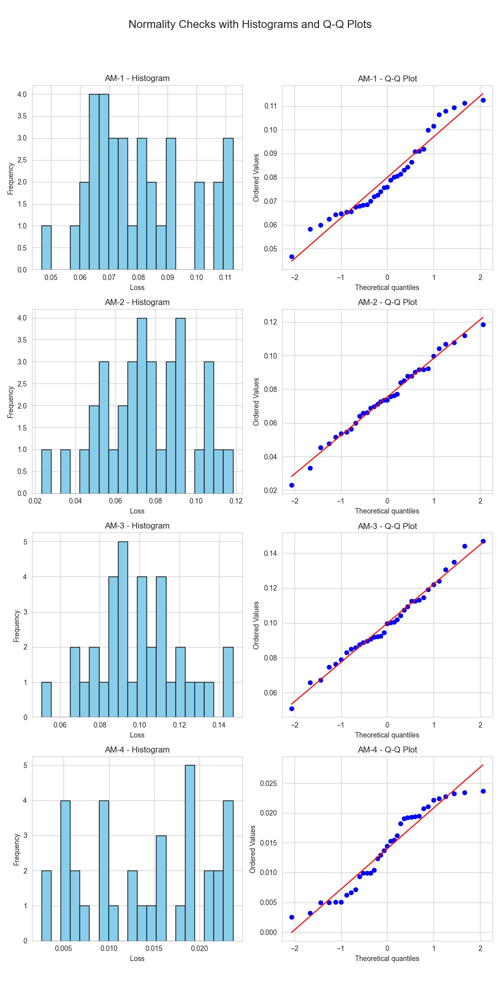{#fig:anova-normality-check}

| attention mechanism | test value | p-value |
|--------------------:|-----------:|--------:|
|                AM-1 |     0.9473 |  0.0938 |
|                AM-2 |     0.9885 |  0.9686 |
|                AM-3 |     0.9879 |  0.9604 |
|                AM-4 |     0.9270 |  0.0228 |

Table: ANOVA normality check \label{table:anova-normality-check}

The homogeneity of variances was checked using a Levene's test.  This showed variances were indeed equal (test value = $8.4004$, p-value = $3.6629\mathrm{e}{-5}$).  Therefore we concluded an ANOVA test could be used, yielding a test value of $147.4071$ and a p-value of $1,4862\mathrm{e}{-5}$, indicating the H~01~ hypothesis should be rejected and we can conclude that not all groups have the same population mean.

For H~02~ we conducted a Tuckey HSD test, see Table \ref{table:tuckey}.  In all but one case (comparison between AM-1 and AM-2), we can reject the H~02~ hypothesis and conclude the mutual means between the groups are not from the same population.

| group1 | group2 | meandiff |  p-adj |   lower |   upper | reject |
|-------:|-------:|---------:|-------:|--------:|--------:|-------:|
|   AM-1 |   AM-2 |  -0.0045 | 0.7253 | -0.0157 |  0.0067 |  False |
|   AM-1 |   AM-3 |   0.0198 | 0.0001 |  0.0086 |  0.0311 |   True |
|   AM-1 |   AM-4 |  -0.0659 |    0.0 | -0.0772 | -0.0547 |   True |
|   AM-2 |   AM-3 |   0.0243 |    0.0 |  0.0131 |  0.0356 |   True |
|   AM-2 |   AM-4 |  -0.0614 |    0.0 | -0.0727 | -0.0502 |   True |
|   AM-3 |   AM-4 |  -0.0858 |    0.0 |  -0.097 | -0.0745 |   True |

Table: Tuckey test \label{table:tuckey}

The test loss mean and standard deviation values are given in Table \ref{table:test-losses}.  This shows the fourier based attention mechanism yields the best results for our specific dataset, outperforming the causal convolution based attention (AM-2) 5 times.

| attention mechanism | average | stddev |
|--------------------:|--------:|-------:|
|                AM-1 |  0.0799 | 0.0169 |
|                AM-2 |  0.0754 | 0.0222 |
|                AM-3 |  0.0998 | 0.0219 |
|                AM-4 |  0.0140 | 0.0068 |

Table: Test losses for the attention mechanisms \label{table:test-losses}

### Results of RQ 2

TODO resultaten beschrijven

# Conclusions and Discussion

In this paper, we analysed the role of attention mechanisms in transformer models for forecasting values of timeseries data.  Several attention mechanisms were evaluated, **(i)** regular self-attention, **(ii)** convoluted self-attention, **(iii)** right padded convoluted self-attention and **(iv)** fourier transform based self-attention.  Input data of Elia, the Belgian electricity transmission network operator, was aggregated to daily values and our models generated a day+1 forecast.  First, we did a mutual comparison of the different attention mechanisms.  Second, we compared the day+1 forecast of our transformer models with the (proprietary) day+1 forecast of Elia.

In evaluating the different attention mechanisms, we implemented a modular and composable base transformer architecture.  This allowed us to only vary the input encodings for each attention mechanism, leaving the rest of the architecture unchanged.  The fourier based input encoding clearly yields the best results in our test setup, outperforming causal convolution 5 times.

Comparing the forecast of the transformer based models to the forecast of Elia did not yield good results.  The predictive model of Elia (no details are published about this model) is clearly better than our transformer based approach.  We can only speculate about the cause of this, but we must mention **(i)** our limited computational resources and number of epochs trained, **(ii)** our fixed set of hyperparameters due to these constraints and **(iii)** the maturity of the Elia model.

We see several possibilities for future work.  First, we have only evaluated the different attention mechanism on one type of dataset (solar power measurements).  This used dataset contained highly regular, cyclical data.  It would be interesting to see whether the same results can be obtained on other types of (less regular) timeseries data like stock market prizes.  Second,  given that **(i)** the fourier input encoding seemed to very efficient in our tests and **(ii)** this input encoding can be used in established transformer architectures, it would be interesting to see if there are benefits in using fourier input encoding in established transformer architectures.

# References

::: {#refs}
:::

# Appendix A : Data general properties

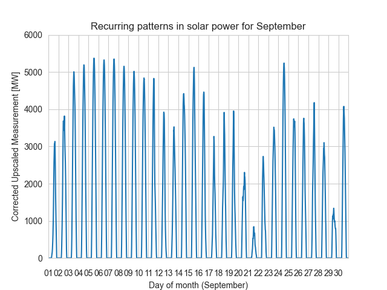{#fig:recurrent-pattern-september}

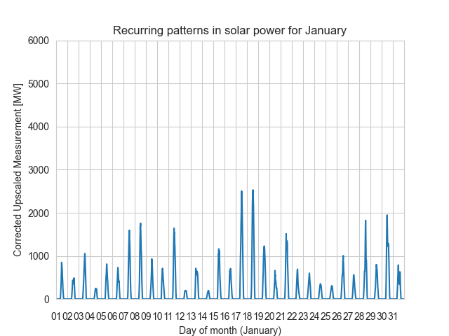{#fig:recurrent-pattern-january}

# Appendix B : Average validation losses (base transformer) 

| layers | heads | forward expansion | average | stddev |
|-------:|------:|------------------:|--------:|-------:|
|      2 |     4 |               256 |  0.0336 | 0.0036 |
|      2 |     8 |               256 |  0.0316 | 0.0023 |
|      4 |     4 |               256 |  0.0324 | 0.0032 |
|      4 |     8 |               256 |  0.0350 | 0.0055 |
|      6 |     4 |               256 |  0.0332 | 0.0031 |
|      6 |     4 |               512 |  0.0353 | 0.0046 |
|      6 |     8 |               256 |  0.0339 | 0.0035 |
|      6 |     8 |               512 |  0.0336 | 0.0047 |
|      2 |     4 |               256 |  0.0059 | 0.0087 |

Table: Average validation losses for base transformer hyperparameter variations \label{table:avg-validation-losses-base-transformer}

# Appendix C : Hyperparameter experimentation validation losses

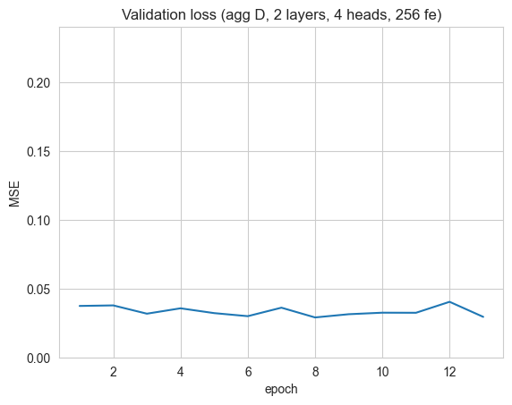{#fig:validation-loss-am-1-1D-2-4-256 height=50% width=50%}

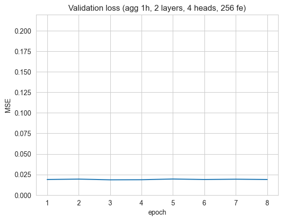{#fig:validation-loss-am-1-1h-2-4-256 height=50% width=50%}

{#fig:validation-loss-am-1-4h-2-4-256 height=50% width=50%}

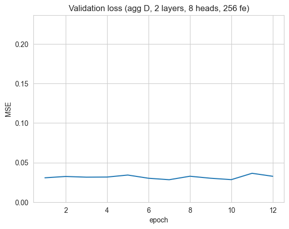{#fig:validation-loss-am-1-1D-2-8-256 height=50% width=50%}

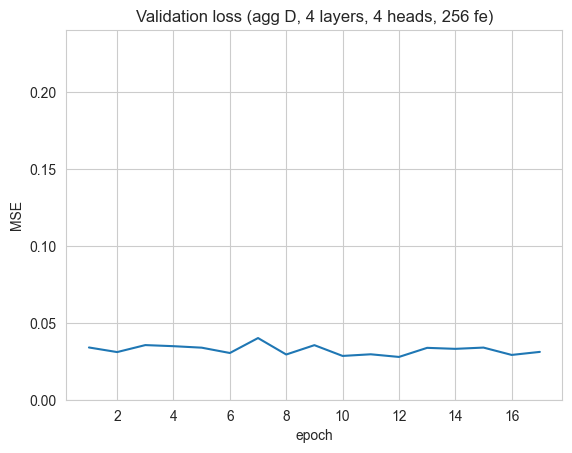{#fig:validation-loss-am-1-1D-4-4-256 height=50% width=50%}

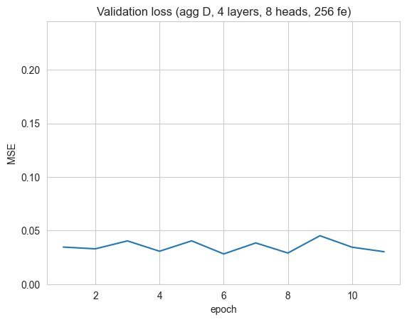{#fig:validation-loss-am-1-1D-4-8-256 height=50% width=50%}

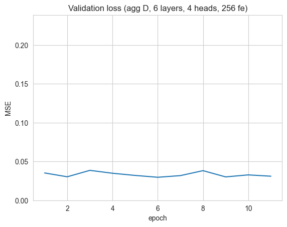{#fig:validation-loss-am-1-1D-6-4-256 height=50% width=50%}

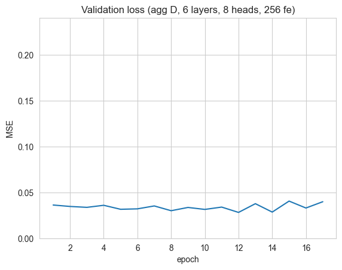{#fig:validation-loss-am-1-1D-6-8-256 height=50% width=50%}

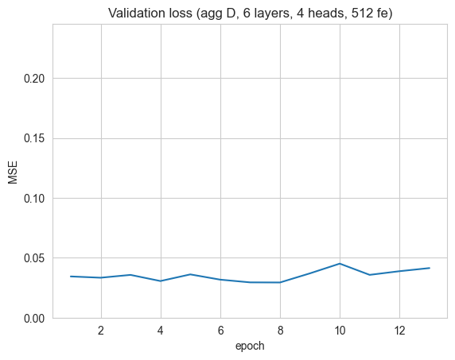{#fig:validation-loss-am-1-1D-6-4-512 height=50% width=50%}

